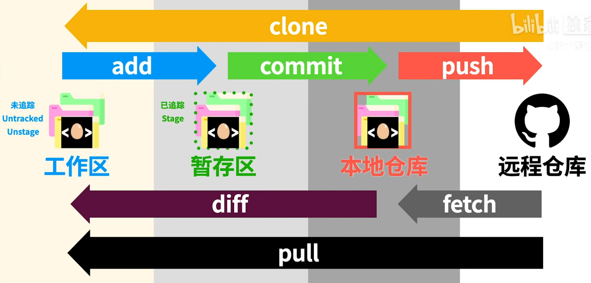

# git基础用法

**git config --global user.name "---"**

**git config --global user.email "---"**

**git init** 		生成.git文件

**clear** 	清屏

**git log**		日志

**git status** 			状态，在什么分支

- 在工作区的（untracked） 
- 在在暂存区的（Changes to be committed:）
- 本地仓库（Changes not staged for commit:）

**git add 文件名** 			提交到暂存区

**git commit 文件名**  		提交到本地仓库

*”nothing added to commit but untracked files present (use "git add" to track)“意思是文件都已经提交到本地仓库*

**git commit -m "注释"** 		不进入vim提交本地仓库

**git commit -am "注释"** 		将add过的，修改后的文件提交本地仓库（不用再重新add）

**vim .gitignore**	创建这个文件，将不想上传的文件名连同后缀写进去，再status时就没有这个文件了

*！！注意！！如果在分支中删除了ignore的文件，即使回到主分支，文件也回不来了*

**git branch 分支名**		创建分支

**git branch** 						查看分支

**git checkout 分支名** 		切换分支

**git branch -d 分支名**		删除分支（没有合并会提示）

**git branch -D 分支名**		直接删除分支

**git checkout -b 分支名**	创建分支并进入分支

**git merge 分支名**	将分支合并到目前分支

**git clone http(手打)**

# 提交GitHub流程

1、github克隆到本地

**$ git clone http(手打)**

2、将要上传的文件复制到本地仓库

3、将文件添加到暂存区,add后面有空格，也可以指定文件名+格式

**$ git add .**

4、将注释和暂存区的文件添加到本地仓库

**$ git commit -m "注释信息"**

5、在github上面创建一个新仓库，并得到仓库地址

6、检查远程地址链接

**$ git remote -v 检查远程仓库信息**

7、将本地仓库内容上传到远程仓库

**$ git push -u origin main**

# 维护仓库

本地改内容前先pull

**git pull origin main**  

改完再push
